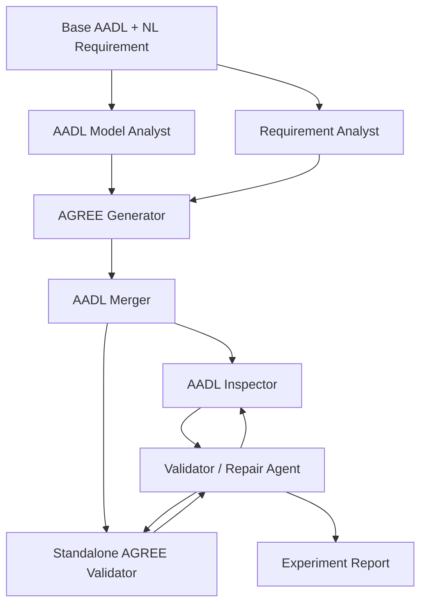

# Architecture

Agree-Autogen uses a validation-centered multi-agent workflow.

## Design principles

- Keep agent roles narrow.
- Treat LLM outputs as candidate artifacts.
- Use external validators as the source of truth.
- Preserve raw first-round outputs for analysis.
- Reject empty, JSON-like, snippet-like, or incomplete AADL outputs before they pollute later stages.

## Error taxonomy

The recorder groups validation errors into five categories:

- T1: lexical and basic syntax errors.
- T2: external references and context errors.
- T3: architecture/component structure violations.
- T4: declaration and identifier conflicts.
- T5: type and numeric-logic errors.
